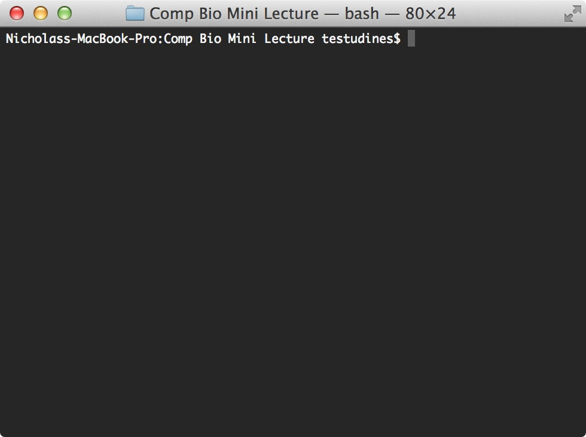

# BASIC LINUX

---

# WHY BOTHER?

- Most computational biology and bioinformatics software is written to run in linux

- Big data analysis is typically conducted on computer clusters which run linux

- Many common tasks, such as sorting and filtering files, are 'easily' done in linux

- Simple collaboration and version control

---

# LINUX AND UNIX

- **UNIX:** is a multitasking, multi-user computer operating system that exists in many variants. The original Unix was developed at AT&T's Bell Labs research center.

- **LINUX:** is a Unix-like and POSIX-compliant computer operating system assembled under the model of free and open source software development and distribution. Originally authored by Linus Torvalds

- **OSX:**  a series of Unix-based graphical interface operating systems developed, marketed, and sold by Apple Inc. Originally based on Free BSD (another UNIX clone).

- Take home message: they're all basically interchangable.

---

# STANDARD KEY COMMANDS

- &#x2325; = option key
- &#8963; = control key
- &#8963; + A = go to beginning of the line
- &#8963; + E = go to end of the line
- &#8963; + U = clear line (works in hidden passwords too!)
- &#x2325; + &larr; or &rarr; = move word by word in line

---

# TERMINAL

---

# COMMON COMMANDS

- **man** [name of command] = **man**ual = print instructions on how to use command.
- **ls** = **l**i**s**t directory
	- **ls -l**  = list directory with more information
	- **ls -a** = show hidden files
- **cd** = **c**hange **d**irectory
	- **cd ..** = move back a directory
	- **cd ~** = return to user directory
- **clear** = clears the screen 
- **pwd** = **p**rint **w**orking **d**irectory
- **which** [name of command] = show location of binary
- **cat** [file name] = print all the lines in a file(s) (e.g., con**cat**enate)
- **head** [file name] = print first 10 lines of file
- **tail** [file name] = print last 10 lines of file

---

# COMMON COMMANDS CONTINUED

- **history** = print all the commands you ran recently.
- **mv** [file name] [new file name] = rename or **m**o**v**e file
- **cp** [file name] [new file name] = **c**o**p**y file
- **wc** -l [file name] = ‘**w**ord **c**ount’, but most commonly used to count all the lines in the file 
- **rm** = **r**e**m**ove/delete file permanently
- **alias** = rename command/commands
- **open** [filename] and **open** . = open a file with the default program
- **du -hcs** = **d**isk **u**sage (-hcs makes the output nice and human-readable)
- **sudo** = run command to give ‘**s**uper **u**ser’ privileges’

---

# NICK! HOW I CAN REMEMBER ALL THIS?

- use the terminal to interact with your computer!
- learn the memory gimmics (e.g., **wc** = **w**ord **c**ount)
- use the **man** command
- paste a linux cheat sheet on the wall in front of your computer
	- This is a pretty decent [cheat sheet](http://files.fosswire.com/2007/08/fwunixref.pdf "Linux Cheat Sheet") 
- look for and ask for answers/advice on [stackoverflow](stackoverflow.com) and [superuser](http://superuser.com/)
- these slides are available on github: [Lecture 01](https://github.com/ngcrawford/Intro_computational_programming_lectures/blob/master/01_intro_linux.md "Lecture 01")

---

# NEXT CLASS

- install os x mavericks if you haven't already (it's free!!!)
- then try installing [homebrew](http://brew.sh/), the instructions are at the bottom of the website

### New Commands:

- pipes and wildcards
- grep
- cut
- sort
- compression (gzip and gunzip) and tar
- top and htop
- curl and wget
- awk, sed, (etc)

