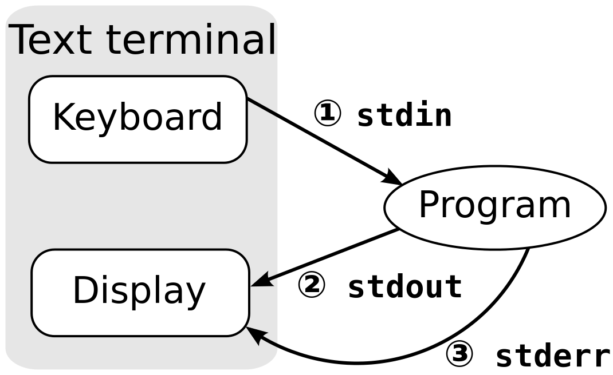

# ADVANCED LINUX

---

# OVERVIEW

- stdin, stdout, stderr
- pipes and wildcards
- grep
- sort

---

# STANDARD OUTPUT AND ERROR

- The result of many commands is printed text on the screen of the terminal/display. This is known as **'standard output'** (stdout).

- If a program runs into problems error codes and instructions are also printed on the terminal/display. This is known as **'standard error'** (stderr).

- By default the two separate **streams** of information are printed to the screen/display.

---

# DIAGRAM

---

# REDIRECTION

- Sometimes you want to save your results!

- And, printing data to the screen is computationally intensive if there is a lot of it.

- Use `>` to redirect **stdout** to a file overwriting anything that's already there.

		ls > directory_output.txt
		cat directory_output.txt

- Use `>>` to append **stdout** to the end a file.

		ls >> directory_output.txt
		ls >> directory_output.txt
		cat directory_output.txt

- Use `2>` to append **stderr** to a file. 

---

# STANDARD INPUT

- Many commands operate on **'standard input'** (stdin).

- Use `<` to send the contents of a file to a command.

	- The following command will count all the lines in a file 

			wc -l < directory_output.txt

- Sometimes your don't want to write all your data to a file - for example if it is very big.

- Use pipes `|` to automatically send standard output from one command into another.

	- The following command will count all the files in a directory.

			ls -l | wc -l

---

# PIPES

- When people talk about writing *bioinformatics* pipelines this is usually what they mean.

	- It is possible to string multiple pipes together

			ls -l | sort | head -2

- This is incredibly powerful. 
	
	- For example, you can run `bowtie2` and then sort and compress the output with `samtools` all in one piped command.

---

# WILD CARDS

- Use `*` to match any value. 

	- For example the following command will only list files ending in `.txt`

			ls -l *.txt

---

# GREP

- "Examines each line of data it receives from standard input and outputs every line that contains a specified pattern of characters."

	- For example, print the header line of a bed file:

			grep "#" test_data/example_bed.bed

    - It's great for checking your data. Use wc -l to make sure there's only one header line.

    		grep "#" test_data/example_bed.bed | wc -l

- Useful flags:

	- `grep -A [NUM]` : Print NUM  lines  of  trailing  context  after  matching  lines. (e.g. `-A` = *AFTER*)

	- `grep -B [NUM]` : Print NUM  lines  of  leading  context  after  matching  lines. (e.g. `-B` = *BEFORE*)

	- `grep -v` : select non-matching lines. Great for removing 'bad data'

---

# SORT

- Use `sort` to reorder the lines of a file.

	- `-t` will allow you to set the delimiter. White space is the default, but if you need to set the delimiter to tabs use `-t$'\t'` and `-t','` for commas.

	- `-k` will allow you to select columns. `-k1,1` will select the first column and `-k2,4` will select the 2nd to the 4th. 

		- You can string the `-k` flags together to sort by multiple columns
		
	- `-g` : compare according to general numerical value

- To sort a bed file by chromosome (column 1) and then by starting position (column 2) use this command 

		sort -k1,1 -k2,2g test_data/example_bed.bed > example_bed.sorted.bed

		

