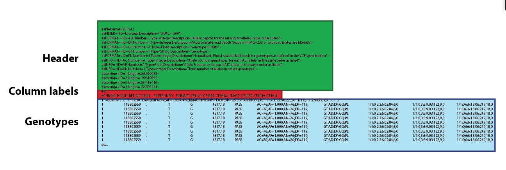
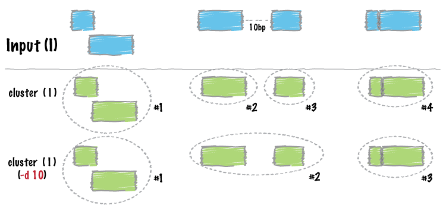
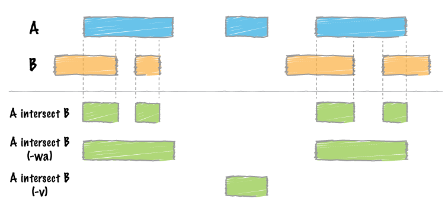

# Common Genomics File Formats

### And, how to work with them...

---

# BED format (Browser Extensible Data)

* Originally from UCSC genome browser.
    * Fields are tab delimited
    * Header starts with "#"

* A minimally formated bed would look like this.

        #chm    start   end statistic
        chr1    11873   14409   0.3
        chr1    14556   14732   0.1

---

# GFF/GTF format (General Feature Format)

* Commonly used to store gene annotations and predictions.

* "The GFF (General Feature Format) format consists of one line per feature, each containing 9 columns of data, plus optional track definition lines." - [ensembl][1]

* The GTF (General Transfer Format) is identical to GFF version 2.

---

# GFF/GTF format field definitions.

Fields must be tab-separated. Also, all but the final field in each feature line must contain a value; "empty" columns should be denoted with a '.'

* **seqname** - name of the chromosome or scaffold; chromosome names can be given with or without the 'chr' prefix.
* **source** - name of the program that generated this feature, or the data source (database or project name)
* **feature** - feature type name, e.g. Gene, Variation, Similarity
* **start** - Start position of the feature, with sequence numbering starting at 1.
* **end** - End position of the feature, with sequence numbering starting at 1.
* **score** - A floating point value.
* **strand** - defined as + (forward) or - (reverse).
* **frame** - One of '0', '1' or '2'. '0' indicates that the first base of the feature is the first base of a codon, '1' that the second base is the first base of a codon, and so on..
* **attribute** - A semicolon-separated list of tag-value pairs, providing additional information about each feature.

---

# VCF format (Variant Call Format)

* Used to store single nucleotide variants (SNVs) and small InDels. It's pretty complex - more than I can go into here.

---

### Basic Arrangement:

* **Header:** contains all the info about how the VCF was created as well as information about the genome.
    * Double pound symbols (##) are used to denote comments.
* **Column labels:** contains all your sample ids!
    * Single pound (#) immediately followed by 'CHROM' is the column label line
* **Genotypes**
    * nine required fields and then an additional set of field equal to the number of samples.

---

# VCF genotype line format.

There are 9 fixed fields per record. All data lines are tab-delimited. In all cases, missing values are specified with a dot (”.”). Formal definition [here][4].

### Fixed fields are:

* **CHROM** (chromosome) - an identifier from the reference genome or an angle-bracketed ID String (`"<ID>"`)
* **POS** (position) - The reference position, with the 1st base having position 1. Positions are sorted numerically, in increasing order, within each reference sequence CHROM.
* **ID** - semi-colon separated list of unique identifiers where available.
* **REF** (reference base(s)) - Each base must be one of A,C,G,T,N (case insensitive). Multiple bases are permitted.
* **ALT** - comma separated list of alternate non-reference alleles called on at least one of the samples.
* **QUAL** - phred-scaled quality score for the assertion made in ALT. i.e. -10log_10 prob(call in ALT is wrong). If ALT is ”.” (no variant) then this is -10log_10 p(variant), and if ALT is not ”.” this is -10log_10 p(no variant).

---

# VCF genotype line format.

* **FILTER** : PASS if this position has passed all filters, i.e. a call is made at this position. Otherwise, if the site has not passed all filters, a semicolon-separated list of codes for filters that fail. e.g. “q10;s50” might indicate that at this site the quality is below 10 and the number of samples with data is below 50% of the total number of samples.
* **INFO** additional information: (String, no white-space, semi-colons, or equals-signs permitted; commas are permitted only as delimiters for lists of values) INFO fields are encoded as a semicolon-separated series of short keys with optional values in the format: <key>=<data>[,data]. Arbitrary keys are permitted, although the following sub-fields are reserved (albeit optional):

---

# Common interactions with your VCF:

* Doh! I forgot my sample IDs.

        cat my_genotypes.vcf | grep '#CHROM'
        cmd-C

* Dammit! This VCF file is big and is using all the space on my hard-drive.

        bgzip my_genotypes.vcf

* Crap! I only want the first 1-500 bp of chr8 of my VCF.

        tabix -p vcf my_genotypes.vcf.bgz
        tabix my_genotypes.vcf.bgz chr8:1-500

---

# VCFtools

* Works with diploid SNVs. Will do basic intersection, merging, filtering, format conversion (e.g. to PLINK) of VCF files as well as calculating summary statistics including: site frequency info, depth, LD, TsTv, site and window pi (nucleotide diversity), Tajima's D, Fst, etc.

* Details [here][5].

---

# BEDtools

* "The development of [bedtools][2] was motivated by a need for fast, flexible tools with which to compare large sets of genomic features."
* Does *'Genome Math'* on BED, VCF, GFF, and SAM files.
* **Example: Complement**

        bedtools complement -i <BED/GFF/VCF> -g <GENOME>

* There are a whole bunch of tools (see [here][3])

---

### Clustering:

        bedtools cluster [OPTIONS] -i <BED/GFF/VCF>

---

### Intesection:

        bedtools intersect [OPTIONS] -a <BED/BAM/GFF/VCF> -b <BED/BAM/GFF/VCF>

---

### Subtraction:

        bedtools subtract [OPTIONS] -a <BED/GFF/VCF> -b <BED/GFF/VCF>

[1]: http://uswest.ensembl.org/info/website/upload/gff.html
[2]: http://bedtools.readthedocs.org/
[3]: http://bedtools.readthedocs.org/en/latest/content/bedtools-suite.html
[4]: http://www.1000genomes.org/wiki/Analysis/Variant%20Call%20Format/vcf-variant-call-format-version-41
[5]: http://vcftools.sourceforge.net/docs.html
